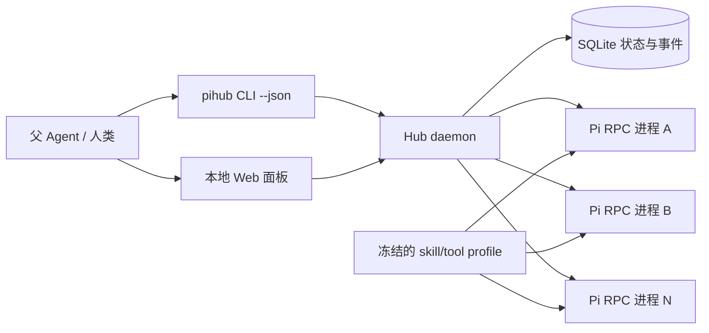

# pi-subagent-hub 1.0.0.0 架构

## 能力边界

`pi-subagent-hub` 为人类或任意父 Agent 提供统一的 CLI 与本地面板，用来创建、观察和管理多个 Pi subagent。初版支持不同模型、独立上下文、稳定 JSON 输出、批量 manifest 和统一生命周期控制。

初版不承诺操作系统级沙箱。进程和上下文相互隔离，但多个 subagent 指向同一个工作目录、数据库或网络服务时，仍可能产生相互可见的外部副作用。

## 核心决策

每个 subagent 使用一个独立的官方 Pi `--mode rpc` 子进程，不把多个 `AgentSession` 放进 Hub 的单个 Node.js 进程。原因是进程边界能隔离堆、上下文、扩展模块实例、会话文件、临时目录和崩溃；代价是增加少量内存与启动时间。

Hub 不调用 `PATH` 中的 `pi`。项目保留 `vendor/pi` 的完整官方源码 clone 用于源码追踪；实际运行入口固定为 `vendor/pi-runtime` 中从 npm 官方 Registry 安装的同版本发布包，并核验源码锁与运行包锁。这样不需要给官方 tag 打私有补丁，也能避开 `v0.85.1` 源码根构建刷新模型目录时缺失 `kimi-coding.models.ts` 的上游构建缺口。



## 隔离契约

每个 subagent 固定拥有不同的：

- OS 进程与 PID；
- `PI_CODING_AGENT_DIR`；
- `PI_CODING_AGENT_SESSION_DIR` 与 Pi session ID；
- `TMPDIR`、事件日志和 stderr 日志；
- extension/tool 运行时实例；
- 生命周期状态与错误记录。

同一 Hub profile 中的 subagent 使用相同的 tool allowlist、skill 路径与 extension 路径。profile 在启动时规范化并计算 SHA-256 digest；Pi 自动发现被关闭，只显式加载该 profile 中的资源，避免不同 `cwd` 偷偷带入不同的 `.pi` 资源。

共享的是只读能力定义，不是进程内状态。未来修改 skill/tool profile 时生成新的 digest；运行中的 subagent 不热切换，需显式重启。

## 数据流

1. 调用方通过 CLI 或面板提交创建请求；daemon 校验工作目录与模型参数。
2. daemon 创建私有目录、记录 stable agent ID，并启动 Pi RPC 子进程。
3. Hub 发送 `get_state`，收到成功响应后才把 subagent 标为 `idle`。
4. prompt/steer/follow-up 通过严格 LF 分帧的 JSONL RPC 发送；所有响应与事件写入对应 agent 日志和中央事件表。
5. `agent_start` 把状态切到 `running`；只有 `agent_settled` 才表示本轮真正结束并回到 `idle`。
6. 停止时依次执行 `clear_queue`、`abort`、`SIGTERM`，超时后才使用 `SIGKILL`。

## 状态与恢复

```text
provisioning -> starting -> idle <-> running
                    |        |          |
                    |        |          +-> waiting_input
                    |        +------------> stopping -> stopped
                    +----------------------> crashed
```

daemon 是 SQLite 与 agent lifecycle 的唯一写入者。daemon 异常重启后无法重新接管旧 stdio，因此不会盲目复用 PID 或重复发送可能带副作用的 prompt；旧活动记录会标为 `crashed`，由调用方显式 `restart` 并沿用原 session ID 恢复上下文。

## 本地 API 与安全

- daemon 只监听 `127.0.0.1` 的随机端口；
- CLI 读取权限为 `0600` 的 control token，并通过 Bearer header 调用；
- Web 面板由 daemon 同源提供，mutating API 仍要求 token；
- 不启用 CORS，不把 token 写入 URL 或浏览器 localStorage；
- 凭据、环境变量值和完整 auth 内容不写入数据库、事件或日志；
- 默认关闭 Pi 安装遥测与版本检查，避免子进程各自执行无关网络请求。

## AI API 配置契约

Hub 将 `$PIHUB_HOME/config/pi-shared/models.json` 作为 endpoint、API 类型、凭据引用和自定义模型的唯一配置入口。每个 agent 的私有 Pi 目录只包含指向这份共享文件的符号链接，因此切换 AI API 不涉及源码或部署副本。修改后先运行 `pihub config validate`，再重启受影响的 agent；新 agent 直接使用新配置。

`auth.json` 只承载 Pi 登录/OAuth 状态。两份文件由 Hub 自动创建并保持 `0600`；校验结果不会返回 URL、API key 或 header 内容。运行状态目录不得位于源码目录内。

## 当前非目标

- 自动创建 Git worktree 或复制任意仓库；
- 容器/虚拟机级文件系统和网络沙箱；
- 运行时热装载新的 skill/tool profile；
- 自动批准 extension UI 请求；
- 跨多个 subagent 的原子事务或共享文件写锁。
